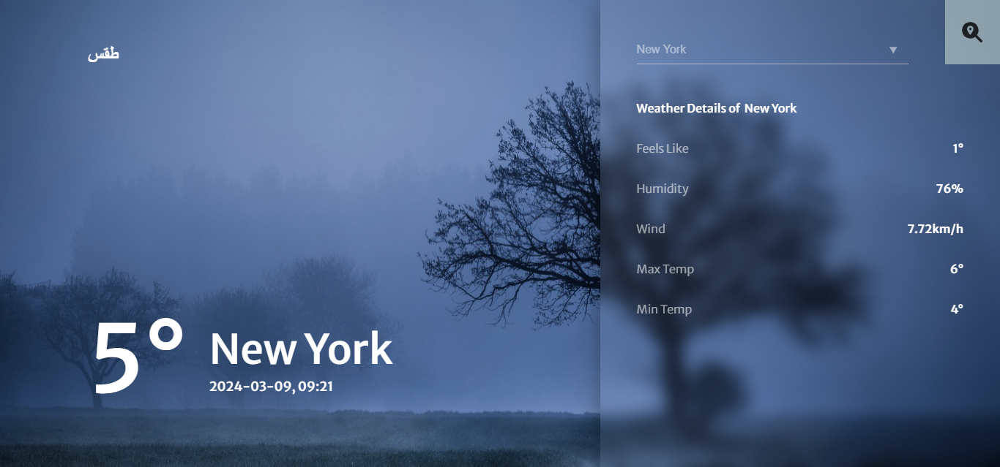

# طقس (Taqs) - Weather Web Application

## Overview
Welcome to the official repository for Taqs, a beautifully designed and responsive weather web application. Taqs provides real-time weather updates to users, helping them stay informed about current weather conditions in their area.

## Features
#### Current Weather: Display current weather conditions including temperature, humidity, wind speed, and more.
#### Location-Based: Allows manual location input for weather updates.
#### Interactive UI: Intuitive and user-friendly interface for seamless navigation and data visualization.
#### Responsive Design: Optimized for various devices and screen sizes for a consistent user experience.
## Technologies Used
#### Frontend: HTML5, CSS3, JavaScript
#### Backend: Utilizes Weather and World Time APIs of API Ninjas

## Acknowledgements
I would like to thank the developers of the weather and time APIs used in this project for their valuable contributions. Also I would like to thank Arthur K. The design of this website is inspired from his work.

#### API Ninjas - https://api-ninjas.com/
#### Work of Arthur K - https://dribbble.com/shots/7376567-Weather-App-Website?utm_source=pinterest&utm_campaign=pinterest_shot&utm_content=Weather+App+Website&utm_medium=Social_Share&utm_source=Clipboard_Shot&utm_campaign=thearthurk&utm_content=Weather%20App%20Website&utm_medium=Social_Share
